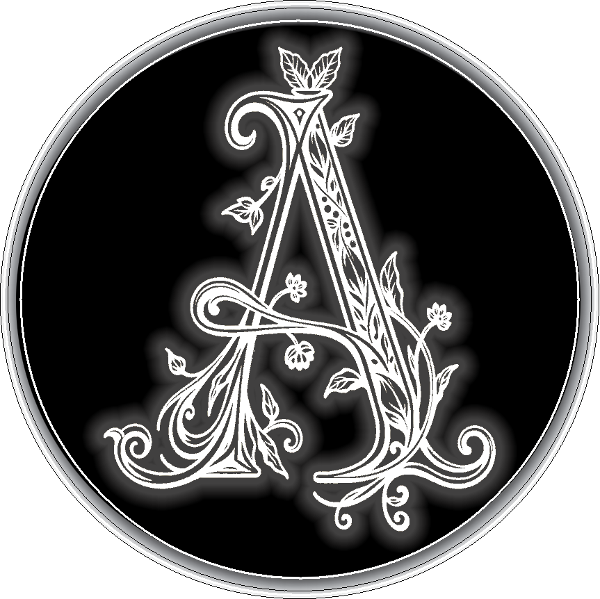

  

## 💬 Hi, I'm Asha❕ 

  I am a graduate student at 🔱**Arizona State University** studying **User Experience Design**, 
  with a background in **interior design, visual communication, and customer experience**.
I’m still new to coding, but I already know I'm going to love it. 🖤

  
  
## 📓 Studies & Interests
- User Experience Design
- Interior Design
- Accessibility
- Visual Storytelling
- HTML & CSS fundamentals

## 💻 Tools
- Figma
- Adobe Creative Suite
- AutoCAD
- GitHub
  
## 💥 Hobbies
- Anything DIY (Destroy, put back together. Rinse, repeat.)
- Music

  
    
##  Find Me Here
- [GitHub Profile](https://github.com/amurdia-design)
- [LinkedIn](https://www.linkedin.com/in/asha-murdia/)
