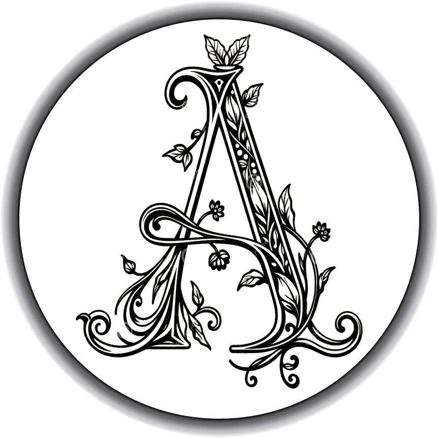

  

## Hi, I'm Asha Murdia

❦

I am a graduate student at **Arizona State University** studying **User Experience Design**, with a background in **interior design, visual communication, and client experience**.

I am currently learning **HTML, CSS, Git, and GitHub** in my web coding class. I’m still new to coding, but I’m especially interested in how design, accessibility, and development come together.

❦

## Studies & Interests
- User Experience Design
- Interior Design
- Accessibility
- Visual Storytelling
- HTML & CSS fundamentals

❦

## Tools
- Figma
- Adobe Creative Suite
- AutoCAD
- GitHub

❦

## Find Me Here
- [GitHub Profile](https://github.com/amurdia-design)
